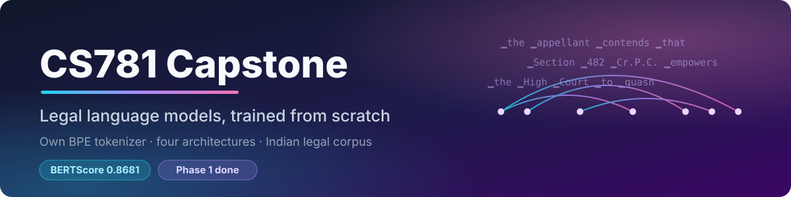

<p align="center">
  
</p>

<p align="center">
  
  
  
  
</p>

An in-house legal AI system for Indian law, built over eight phases.
Every model is trained from scratch with our own BPE tokenizer: no pretrained weights, no imported model classes.

## ✨ Highlights

- **4 architectures**, 61M to 139M parameters, all trained on a free Kaggle T4
- **Own tokenizer**: byte-level BPE, 16,384 tokens, trained on the legal corpus
- **Best Phase 1 score: 0.8681 BERTScore F1** (Arch 2 + retrieval-augmented fine-tuning + MBR decoding)

## 🏛️ Phase 1: legal text continuation

> Given a 512-word legal prompt, write the next 128 words. Scored by BERTScore F1 (roberta-large).

| | Architecture | Params | Score |
|:--:|---|:--:|:--:|
| 1 | GPT-2 style decoder: sinusoidal positions, LayerNorm, GELU | 97.6M | 0.8299 |
| 2 | LLaMA style decoder: RoPE, RMSNorm, SwiGLU, grouped-query attention | 61.6M | 0.8334 |
| 3 | Encoder-decoder: span corruption + continuation objective | 86.1M | 0.8275 |
| 4 | Deep decoder: latent attention, QK-Norm, gated attention, Engram memory | 139.1M | 0.8365 |

### 📈 Climbing the leaderboard (Arch 2)

| Arch 2 variant | Score |
|---|:--:|
| Original model, plain sampling | 0.8334 |
| Continued pretraining (+329M tokens), plain sampling | 0.8351 |
| Original model + MBR decoding, 8 samples | 0.8388 |
| Original model + MBR decoding, 16 samples | 0.8402 |
| **Original model + retrieval-augmented fine-tune + MBR** | **0.8681** |

## 🗂️ Repository

```
.
├── assets/                 banner
└── Phase 1/
    ├── notebooks/          training, decoding, retrieval (Kaggle notebooks)
    ├── tokenizer/          BPE code + trained legal vocabulary
    └── results/<model>/    metrics.json + loss curves for every run
```

## 🚀 Running

- Notebooks target **Kaggle**: GPU T4, Internet on, an `HF` secret with access to `Exploration-Lab/CS-781-Capstone`
- Open a notebook, attach the inputs listed in its first cell, then **Save & Run All**
- Python packages: [`requirements.txt`](requirements.txt)
- Trained weights are too large for GitHub and are kept on Kaggle

## 🛣️ Roadmap

| Phase | Task | Status |
|:--:|---|:--:|
| 1 | Legal language model pretraining | ✅ |
| 2 | Named entity recognition | ⏳ |
| 3 | Rhetorical role labelling | ⏳ |
| 4 | Judgment prediction | ⏳ |
| 5 | Statute identification | ⏳ |
| 6 | Summarisation | ⏳ |
| 7 | Case retrieval | ⏳ |
